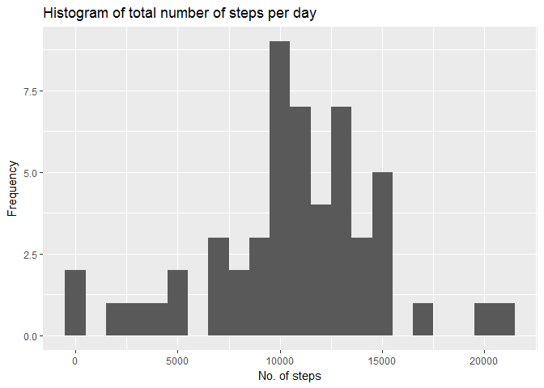
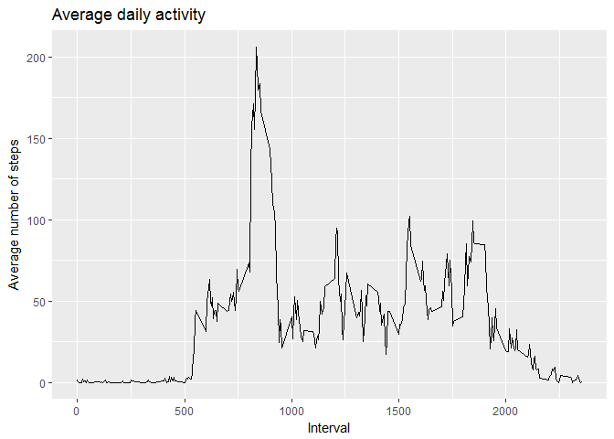
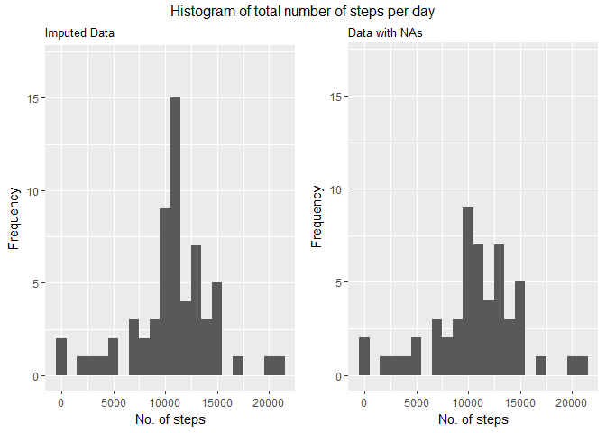
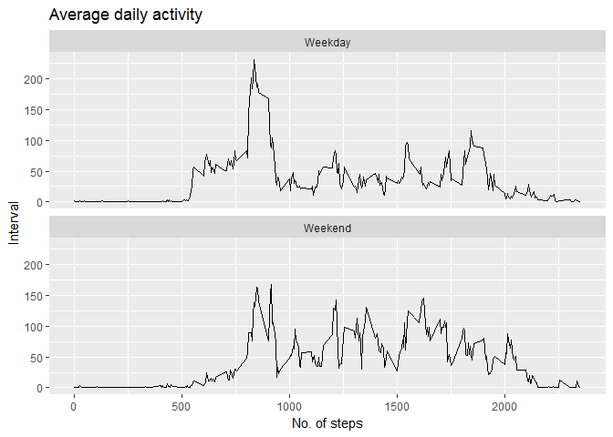

# Reproducible Research: Peer Assessment 1


## Introduction

It is now possible to collect a large amount of data about personal movement using activity monitoring devices such as a Fitbit, Nike Fuelband, or Jawbone Up. These type of devices are part of the "quantified self" movement - a group of enthusiasts who take measurements about themselves regularly to improve their health, to find patterns in their behavior, or because they are tech geeks. But these data remain under-utilized both because the raw data are hard to obtain and there is a lack of statistical methods and software for processing and interpreting the data.

This project makes use of data from a personal activity monitoring device. This device collects data at 5 minute intervals through out the day. The data consists of two months of data from an anonymous individual collected during the months of October and November, 2012 and include the number of steps taken in 5 minute intervals each day.

The variables included in the dataset are:

- **steps**: Number of steps taking in a 5-minute interval (missing values are coded as NA)
- **date**: The date on which the measurement was taken in YYYY-MM-DD format
- **interval**: Identifier for the 5-minute interval in which measurement was taken

The dataset is stored in a comma-separated-value (CSV) file and there are a total of 17,568 observations in this dataset.

## Loading and preprocessing the data

The following code loads the data into a data frame and ensures that the variables are in the right format.


```r
# Load required packages
library(gridExtra)
library(knitr)
library(ggplot2)

unzip("activity.zip")        

# Read the data
df <- read.csv("activity.csv")
df$date = as.Date(df$date)
```


## What is mean total number of steps taken per day?

The following code produces a histogram of total number of steps per day and find this distribution's mean and median.


```r
# Sum up no. of steps for each day
df_daysum <- aggregate(steps ~ date,df,sum, na.rm = TRUE)

# Plot the histogram
ggplot(df_daysum, aes(x = steps)) + 
        geom_histogram(binwidth = 1000) + 
        labs( title = "Histogram of total number of steps per day",
              x = "No. of steps",
              y = "Frequency" )
```

<!-- -->

```r
# Find the mean and median
mean(df_daysum$steps)
```

```
## [1] 10766.19
```

```r
median(df_daysum$steps)
```

```
## [1] 10765
```

The mean is 10766.19 and median is 10765


## What is the average daily activity pattern?

The following code makes a time series plot (i.e. type = "l") of the 5-minute interval (x-axis) and the average number of steps taken, averaged across all days (y-axis). It also finds the interval with maximum number of steps on average.


```r
# Find average number of steps for each interval
df_avgint <- aggregate(steps ~ interval, df, mean, na.rm = TRUE)

# Plot the time series graph
ggplot ( df_avgint, aes(x = interval, y = steps) ) +
         geom_line() +
         labs( title = "Average daily activity",
               x = "Interval",
               y = "Average number of steps" )
```

<!-- -->

```r
# Find the interval with max steps
df_avgint[which.max(df_avgint$steps),]
```

```
##     interval    steps
## 104      835 206.1698
```

Thus, the interval with maximum steps on average is 835

## Imputing missing values

The following code finds the number of missing values (steps) in the dataset. Then it imputes those missing steps with the mean of the number of steps for that particular interval. It creates a new data set with those imputed values. Changes in the histogram, mean and median caused by this imputation is observed.


```r
# Total number of missing values(NA)
sum(is.na(df$steps))
```

```
## [1] 2304
```

```r
# Split the data based on the presence of NAs
df_notNA <- df[!is.na(df$steps), ]
df_NA <- df[is.na(df$steps), ]               

# Find the mean for each interval
avg_steps <- aggregate( steps ~ interval, df_notNA, mean )

# For each row with NA, its corresponding average from the avg_steps is
# taken by matching the interval

df_NA$steps <- sapply(df_NA$interval, function(x) avg_steps[which(avg_steps$interval == x), 2])

# Created a new data set with the imputed data
imputed <- rbind(df_NA, df_notNA)

# Sum up the number of steps for each day
imputed_daysum <- aggregate(steps ~ date,imputed,sum)

# Plot the histograms for after/before imputation
p1 <- ggplot(imputed_daysum, aes(x = steps)) + 
        geom_histogram(binwidth = 1000) + 
        labs( subtitle = "Imputed Data",
              x = "No. of steps",
              y = "Frequency" ) + ylim(0,17)

p2 <- ggplot(df_daysum, aes(x = steps)) + 
        geom_histogram(binwidth = 1000) + 
        labs( subtitle = "Data with NAs",
              x = "No. of steps",
              y = "Frequency" ) + ylim(0,17)

grid.arrange(p1, p2, ncol = 2, top = "Histogram of total number of steps per day")
```

<!-- -->

```r
# Mean after imputation
mean(imputed_daysum$steps)
```

```
## [1] 10766.19
```

```r
# Mean before imputation
mean(df_daysum$steps)
```

```
## [1] 10766.19
```

```r
# Median after imputation
median(imputed_daysum$steps)
```

```
## [1] 10766.19
```

```r
# Median before imputation
median(df_daysum$steps)
```

```
## [1] 10765
```

As seen, the peak of the distribution has increased after imputation. While the mean remains the same, the median has marginally increased. Both  the mean and median of the imputed data are 10766.19

## Are there differences in activity patterns between weekdays and weekends?

The following code creates a new factor variable indicating whether a date is weekday or weekend. It then created a panel plot containing a time series plot (i.e. type = "l") of the 5-minute interval (x-axis) and the average number of steps taken, averaged across all weekday days or weekend days (y-axis).


```r
# Find the corresponding day of each date 
imputed$day_type <- weekdays(imputed$date)

# Replace day with weekday or weekend accordingly
imputed$day_type <- gsub("Saturday|Sunday","Weekend", imputed$day_type)
imputed$day_type <- gsub("Monday|Tuesday|Wednesday|Thursday|Friday","Weekday", imputed$day_type)

# Convert it into a factor variable
imputed$day_type <- as.factor(imputed$day_type)

# Average the days across interval and day type
imputed_avgint <- aggregate(steps ~ interval + day_type, imputed, mean)

# Plot the time series graphs
ggplot (imputed_avgint, aes(x = interval, y = steps)) +
        geom_line() +
        facet_wrap( ~ day_type, nrow = 2 ) +
        labs( title = "Average daily activity",
              x = "No. of steps",
              y = "Interval" )
```

<!-- -->

Thus, there is a significant increase in the activity levels during the weekend as compared to the weekdays.
